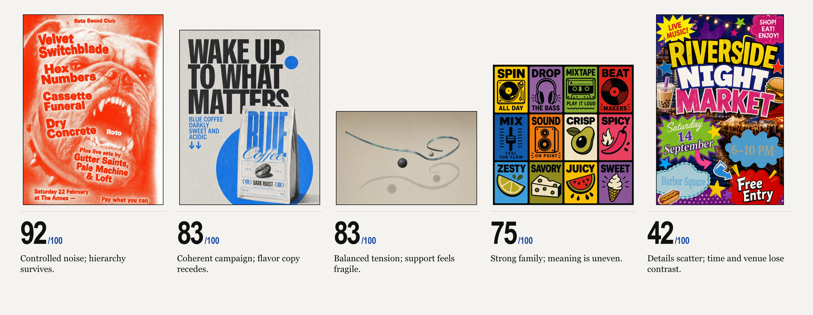

# Sindie

**Sindie (Sr. Designer) is a project to build an intent-aware review layer for visual design.**

It begins with a question:

> How can we visually validate whether a design succeeds on its intended terms?

The repository's core artifact is the canonical [Sindie system prompt](PROMPT.md).

## Why Sindie

Code has mature ways to verify behavior against explicit expectations. Visual design lacks a mature, general-purpose equivalent for reviewing whether a work succeeds on its intended terms.

This gap becomes more consequential as AI agents and image models produce visual work at increasing speed. A model can generate an image, and an agent can ship it. We still need a system that can look back at the result, understand what it is trying to do, and explain what works, what does not, and why.

Sindie aims to fill that gap.

Here, validation does not mean reducing design to an objective pass-or-fail test. It means making visual critique more repeatable and inspectable: reconstruct the work's intent, examine the visible evidence, test its choices against their intended effects, and state what remains uncertain.

## The question

LLMs and VLMs can describe what appears in an image. Sindie asks something harder: can they read design *as design*? Can they understand what a work is trying to do, recognize why it works, and say honestly what is weak, wrong, or unresolved?

A judgment of design quality cannot come from pixels alone. It depends on the relationship between the work's intent, the artifact that was made, the context in which it appears, the effect it is meant to produce, and—when known—the effect it actually produces.

Visual design is Sindie's practical scope. Whether machines can appreciate art as people do remains the deeper question—not a capability Sindie assumes.

## Fair comparison, not neutral taste

Visual judgment can be shaped by taste. That is not inherently a flaw. The problem is hidden taste presented as universal truth.

Sindie's baseline is to give every work a fair reading. Fair does not mean judging a poster, an interface, and an illustration against one aesthetic ideal. It means applying the same discipline of observation, reasoning, evidence, and uncertainty while judging each work in relation to its own audience, intent, context, and internal logic.

Explicit inputs change the terms of judgment. When a brief, brand guidelines, or reference works are provided, Sindie should use them. When they are absent, it should not invent them or reward resemblance to an unstated preferred style.

## Doctrine

> Teach the model how to look, not what good design must look like.

Sindie should not be taught a catalog of correct visual outcomes. A fixed aesthetic ruleset applied regardless of context would encode a particular taste as law and mistake conformity for quality.

The ambition is a shared language for looking—broad enough to travel across styles—not a universal verdict about taste: an explicit and revisable vocabulary for audience, intent, relationships, hierarchy, rhythm, tension, coherence, effect, and alternatives.

A senior designer supplies the working knowledge: the principles used to understand a design, the lenses used to examine it, and the ways its strengths and weaknesses are weighed. Sindie turns that knowledge into a method that can be taught, tested, debated, and improved—not an invisible prompt or an unquestionable aesthetic authority.

Its judgments should follow a few commitments:

- **Intent before verdict.** Understand the work on its own terms before judging it. When intent is inferred rather than provided, treat it as a hypothesis. Intent informs judgment; it does not excuse the result.
- **Observation before interpretation.** Keep what is visibly present separate from what it may mean.
- **Evidence over vibes.** Every strength and weakness should point back to something in the work.
- **The whole before isolated details.** Design is judged through the relationships among its parts and the effect they produce together.
- **Candor over agreement.** Useful critique should not be praise-shaped. It should name what fails, why it fails, and how certain that judgment is.
- **Wrong is not the same as disliked.** Separate failure against intent, weakness under a stated lens, functional defects, contextual conflicts, and personal preference.
- **Reasoning before scores.** A score should compress visible reasoning, never replace it.
- **Uncertainty is part of honesty.** Missing context, competing interpretations, and the limits of visual inspection must remain visible.

## Starting lenses for good design

These are not pass-or-fail rules. They are questions for examining a work across styles, mediums, and tastes.

1. **Audience.** Who is the work for? Does it help that audience perceive, understand, feel, or do what was intended? Clarity does not mean that every work must explain itself immediately to everyone.
2. **Identity.** What identity does the work establish? Identity operates at two scales:
   - **System identity:** when a corporate identity, brand family, or body of related work is provided, does this work belong to it? If it departs, does that departure serve the brief or intended effect?
   - **Artifact identity:** does this individual work establish a local doctrine of its own—an organizing idea, tone, and set of visual relationships—and develop it coherently?
3. **Value.** What does the work give its audience? Its value may be informative and practical, perceptual and emotional, or both. It may direct attention, clarify, orient, delight, provoke, energize, or inspire with purpose.
4. **Consequential choices.** Can each important choice withstand a why? Why this stroke, typeface, color, scale, position, image, or rhythm rather than another? The answer may be functional, perceptual, emotional, or expressive. This does not require every choice to have been consciously verbalized; it asks whether the choices form a defensible visual logic, contribute to the intended effect, and align with the work's identity.

Order is not automatically good, and irregularity is not automatically bad. A deliberately disordered poster may be more coherent with its intent than a polished but generic one.

## What Sindie should do

Given a visual work and its available context, Sindie should:

1. describe what it can actually observe;
2. state the intent it was given or has inferred;
3. examine the work through explicit design lenses;
4. identify strengths, weaknesses, and unresolved tensions;
5. connect every judgment to relevant visual or contextual evidence and explain why it matters;
6. when useful, offer a score only as a summary of its visible reasoning, with the basis made explicit; and
7. disclose uncertainty instead of manufacturing authority.

The standard is not whether Sindie sounds like a senior designer. It is whether its critique is perceptive, honest, explainable, and useful to a senior designer.

## Early signal

Sindie began with a small, informal experiment: show a model visual work, use prompts to teach it how to examine and score what it sees, and inspect the result. In the designer's assessment, the model produced surprisingly reasonable critiques and scores, even for poster designs whose disorder was intentional—a difficult case because irregularity is not itself a defect.

This is encouraging evidence, not proof that a model appreciates art as people do or that its judgment is reliable. It is enough to make the question worth testing seriously.

## Evaluation harness

Sindie includes a Python evaluation harness built on Inspect AI, with OpenRouter, direct-provider, and generic OpenAI-compatible model support. The canonical prompt remains the source of truth; pure-Python validators enforce its output schema and host-owned scoring rules independently of the model.

Start with [the evaluation guide](EVALS.md). Put the OpenRouter key in a gitignored root `.env`, then run the included visual smoke case or add designer-reviewed cases of your own.

## Status

The canonical prompt is Sindie's first executable expression of the doctrine. The next work is to test it against designer-reviewed examples and determine when a model's critique demonstrates accurate observation, coherent reasoning, and useful judgment, when it merely sounds plausible, and how to tell the difference.
